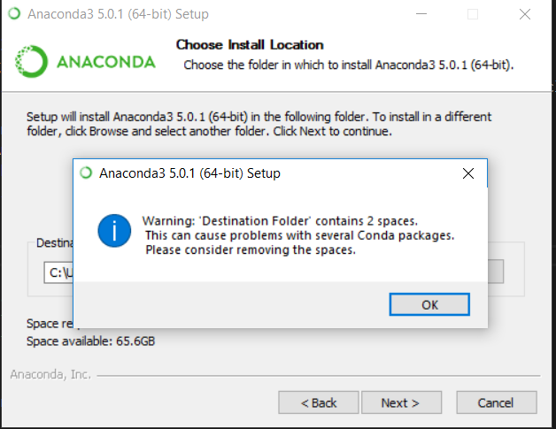
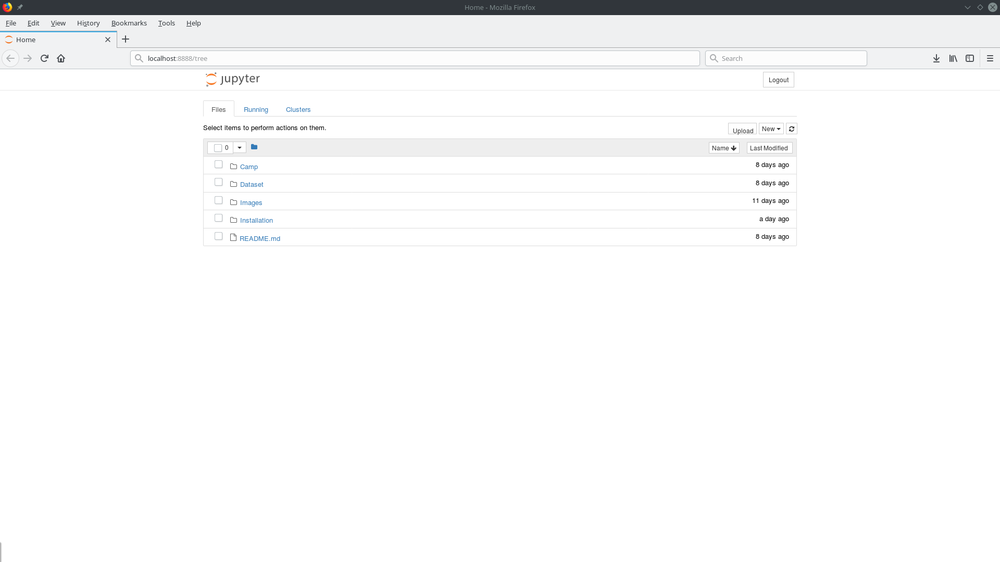

# Installation Anaconda on Windows

There are some phase installation that required before join DSW AI Camp by Nodeflux.

## What you need:
* Git
* Python (Anaconda3)
* Tensorflow
* Opencv

## Git Installation
1. Download git installer [here](https://git-scm.com/downloads)
2. Then Install it. You can set the instalation setting as you want (or just click next till the end)

## Anaconda Installation
1. Download Anaconda installer [here](https://www.anaconda.com/download/)
2. Choose Python 3.6 version and click Download
3. Then Install it.

### Noted



If you got this error, It might be happened because of `Destination Folder`. The `Destination Folder` should not have any spaces, e.g.: `C:\Users\Rizqi Okta E\Anaconda3`, it contains 2 spaces on `Rizqi(space)Okta(space)E`. To tackle this problem , you can change the `Destination Folder` to anywhere  which is without using any spaces, e.g.: `D:\Programming_Stuff\Anaconda3`

## Create a Conda virtual environment
Assuming Conda is working, we will now create our Conda environment:
```
conda create -n dsw-nodeflux python=3.6
```

This bootstraps a new Conda environment named `dsw-nodeflux` with a minimal Python 3.6 install. You will be presented with a 'package plan' listing the packages to be installed and asked whether to proceed: type `y` then enter.

We will now *activate* our created environment:

```
source activate dsw-nodeflux
```

If you wish to deactivate an environment loaded in the current terminal e.g. to launch the system Python interpreter, you can run `source deactivate` 

## Create conda environtment and dependencies installation
1. Open `Anaconda Prompt` by click `Windows button` then type `Anaconda Prompt` and then click it.
2. We will now create our Conda environment. Type `conda create -n dsw-nodeflux python=3.6`
3. This bootstraps a new Conda environment named `dsw-nodeflux` with a minimal Python 3.6 install. You will be presented with a 'package plan' listing the      packages to be installed and asked whether to proceed: type `y` then enter.
4. We will now *activate* our created environment: type `conda activate dsw-nodeflux` then press `enter` 
5. Type ```conda install -c conda-forge opencv``` then press `enter` to install Opencv
6. Type `conda install tensorflow=1.4.1` then press `enter` to install tensorflow
7. If you wish to deactivate an environment, you can type `conda deactivate` then press `enter` 
## Testing Jupyter Notebook
After all you can checking the installation with running Jupyter Python Notebook.
1. Open `Anaconda Prompt`
2. Type `conda activate dsw-nodeflux`, then press `enter` to activate our environment
3. Type `cd <path_to_DSW-Camp-AI>` e.g.: `cd C:\Users\Rizqi Okta E\Documents\DSW-Camp-AI`, then press `enter` 
4. Type `jupyter notebook`, then press `enter` 
5. Then you will be directed to your default browser as shown below:



*If you fail redirect to your browser, you can copy/paste the url on your `Anaconda Prompt` to your browser
## Finally
If you have some trouble about the installation, feel free to email me at rizqi.okta@nodeflux.io.

